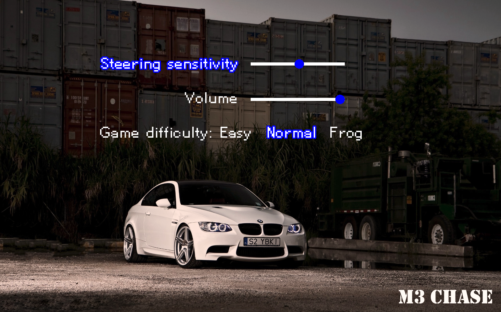

# M3 Chase

**Simple 2D car game created in C++ using SFML**
This project was developed during one of my first classes at AGH. The goal is to steer your car while avoiding oncoming obstacles (like police cars). As you progress, the game gets faster and more challenging. If you collide, you see an explosion and a "game over" screen.

## Features

1. **Main Menu**  
   - **Play** – Start the game immediately.  
   - **Settings** – Adjust steering sensitivity, game volume, and difficulty (Easy, Normal, or Frog).  
   - **About** – Shows an info screen (can include your own text or images).  
   - **Quit** – Exit the game.

2. **Scoring & High Score**  
   - The game saves your **last score** and **highest score** (stored in simple text files).  
   - Each obstacle you pass increases your current score.  

3. **Game Mechanics**  
   - **Steering**: Use the arrow keys (left/right) to avoid the obstacles.  
   - **Increasing Speed**: The game speed gradually increases with your score and chosen difficulty.  
   - **Collision**: If the car’s position overlaps with an obstacle, you crash, and the game ends.

4. **Audio & Music**  
   - **Menu Music**: A looped track plays in the background of the main menu.  
   - **In-Game Music**: A different looped track plays while you drive.  
   - **Sound Effects**: Collision has a crash/explosion sound.

5. **Customizable Settings**  
   - **Steering Sensitivity**: Decide how sensitive the car is to left/right key presses.  
   - **Volume Control**: Adjust background music volume.  
   - **Difficulty Levels**:  
     - *Easy* – Slower speeds.  
     - *Normal* – Medium speed growth.  
     - *Frog (the hardest one)* – Very fast and challenging.

     ## Screenshots
  
*Main menu*

---

  
*Settings*

---

  
*Game plot*

---

  
*Start screen*

---

  
*Gameplay*

---

  
*Game over*

---

## Code Overview

- **GameCore**  
  Holds important constants, global variables (for example, movement limits, speed scaling), and setup functions.

- **GameEngine**  
  Defines the main `gaming(...)` function, which runs the core game loop: handling events, updating positions, checking collisions, and displaying sprites on the screen.

- **GameLogic**  
  Contains helper functions for randomizing obstacle positions, calculating game speed, and initializing the player/obstacles.

- **GameIO**  
  Handles reading and writing scores to text files (`lastscore.txt` and `highscore.txt`).

- **menu**  
  Manages the main menu navigation, including selection of Play, Settings, About, and Quit.

- **GameResources**  
  Loads and stores all textures, fonts, and sounds from the `assets` folder (e.g. road, car, police, explosion sprites, music, sound effects, and fonts).

  ## Requirements

- **Visual Studio** (Project files are included in the repository, so just open the `.sln` or `.vcxproj` file).
- Everything else **(like SFML)** is already set up within the project.  
- After cloning the repository, simply build and run from **Visual Studio**.